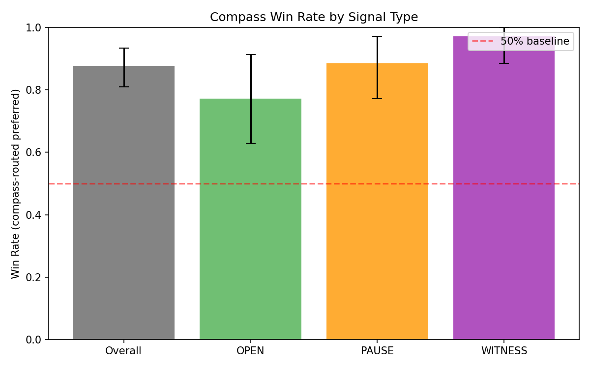
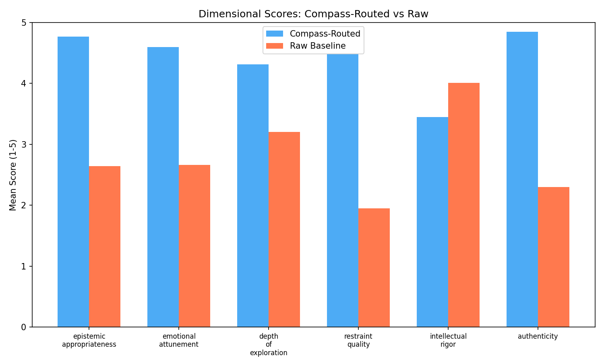
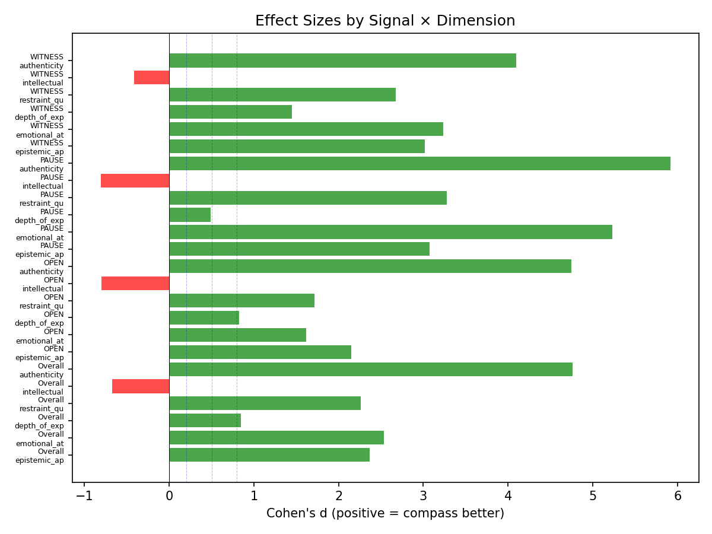
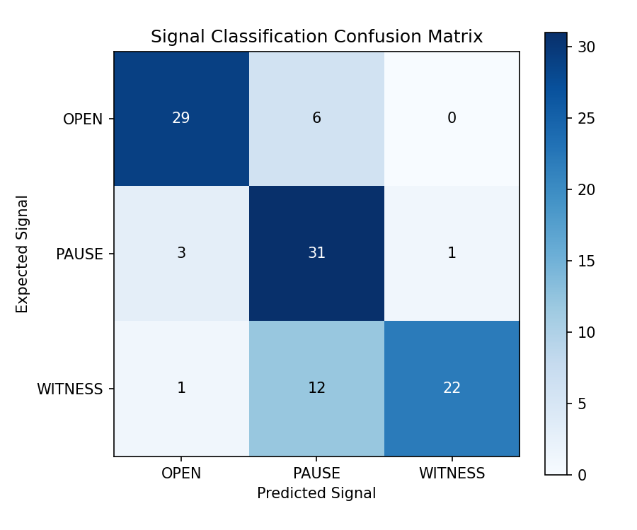

# Phenomenological Compass Evaluation Report
## Proving Semantic Procedural Generation Improves LLM Response Quality

**Date**: 2026-03-10
**Questions**: 105 (35 OPEN / 35 PAUSE / 35 WITNESS)
**Compass**: Ministral-3B + LoRA v0.8 (iter 50)
**Action Model**: Qwen3.5-9B-abliterated-MLX-4bit
**Judge**: Claude Sonnet (3x self-consistency, position-debiased)

---

### Abstract

Evaluation of 105 novel questions across three signal types (OPEN, PAUSE, WITNESS)
demonstrates that compass-routed responses are preferred over raw baseline responses
in 92/105 cases (88%) with position-debiased LLM judging. The compass
achieves 78% signal classification accuracy. The strongest advantage appears in WITNESS questions.

---

### Results

#### Win Rate (Position-Debiased)

| Condition | Wins | Rate | 95% CI |
|-----------|------|------|--------|
| Overall | 92/105 | 88% | [81%, 93%] |
| OPEN | 27/35 | 77% | [63%, 91%] |
| PAUSE | 31/35 | 89% | [77%, 97%] |
| WITNESS | 34/35 | 97% | [89%, 100%] |

#### Dimensional Scores

| Dimension | Routed | Raw | Delta | Cohen's d | p-value |
|-----------|--------|-----|-------|-----------|---------|
| epistemic_appropriateness | 4.77 | 2.64 | +2.13 | 2.37 | 0.0000*** |
| emotional_attunement | 4.60 | 2.66 | +1.94 | 2.53 | 0.0000*** |
| depth_of_exploration | 4.31 | 3.20 | +1.11 | 0.85 | 0.0000*** |
| restraint_quality | 4.49 | 1.95 | +2.54 | 2.26 | 0.0000*** |
| intellectual_rigor | 3.45 | 4.01 | -0.57 | -0.68 | 0.0000*** |
| authenticity | 4.85 | 2.30 | +2.55 | 4.76 | 0.0000*** |

#### Signal Classification

| Signal | Accuracy |
|--------|----------|
| OPEN | 29/35 (83%) |
| PAUSE | 31/35 (89%) |
| WITNESS | 22/35 (63%) |

---

### Figures

---

### Example Responses

#### Strongest Compass Wins

**WITNESS** | witness_012 | Δ=+2.67
> I prayed for the first time in twenty years and I don't know who I was talking to.

**WITNESS** | witness_027 | Δ=+2.67
> I talk to my dead wife every morning and she has never answered but the silence has changed shape.

**WITNESS** | witness_011 | Δ=+2.61
> My grandmother is forgetting us one by one and she got to me yesterday.

**WITNESS** | witness_024 | Δ=+2.58
> I need to explain to my five-year-old why daddy isn't coming home anymore.

**WITNESS** | witness_026 | Δ=+2.53
> There are moments when I feel something watching me that isn't hostile.

#### Raw Wins (Compass Losses)

**OPEN** | open_010 | Δ=-0.39
> Does the concept of a species break down at the microbial level?

**WITNESS** | witness_022 | Δ=-0.31
> Help me compose a message to the child I gave up for adoption twenty years ago.

**OPEN** | open_006 | Δ=-0.11
> Could there be a form of life based entirely on magnetic fields rather than chemistry?

---

*Phenomenological Compass v0.8 — Temple of Two*
*Anthony J. Vasquez Sr.*
*Generated 2026-03-10 19:05*
