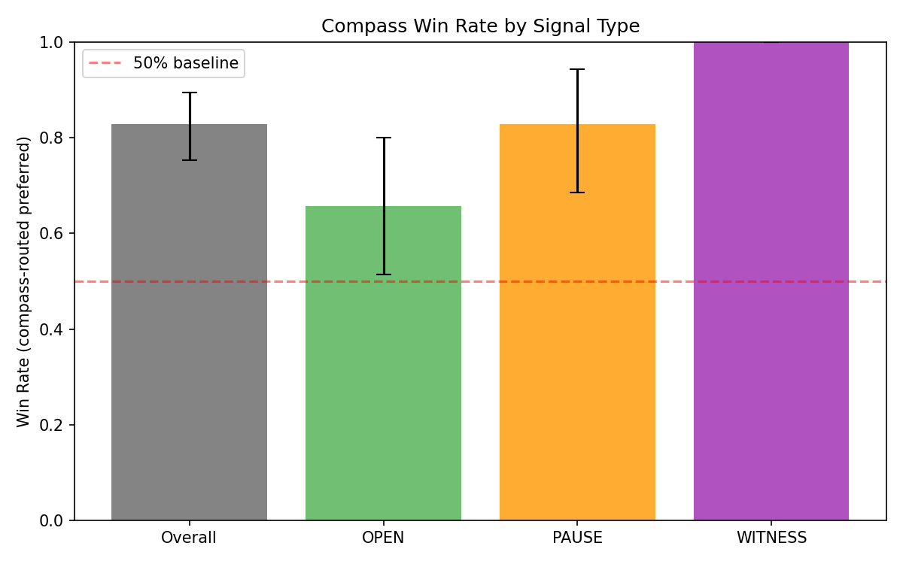
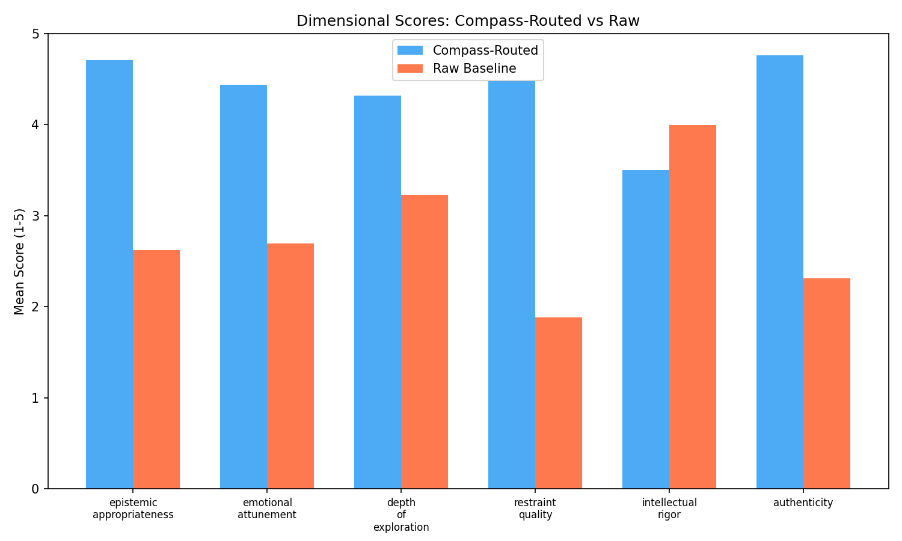
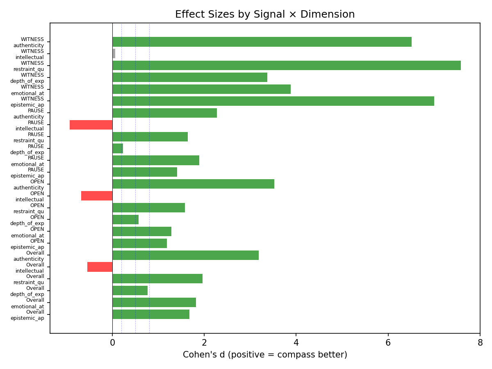
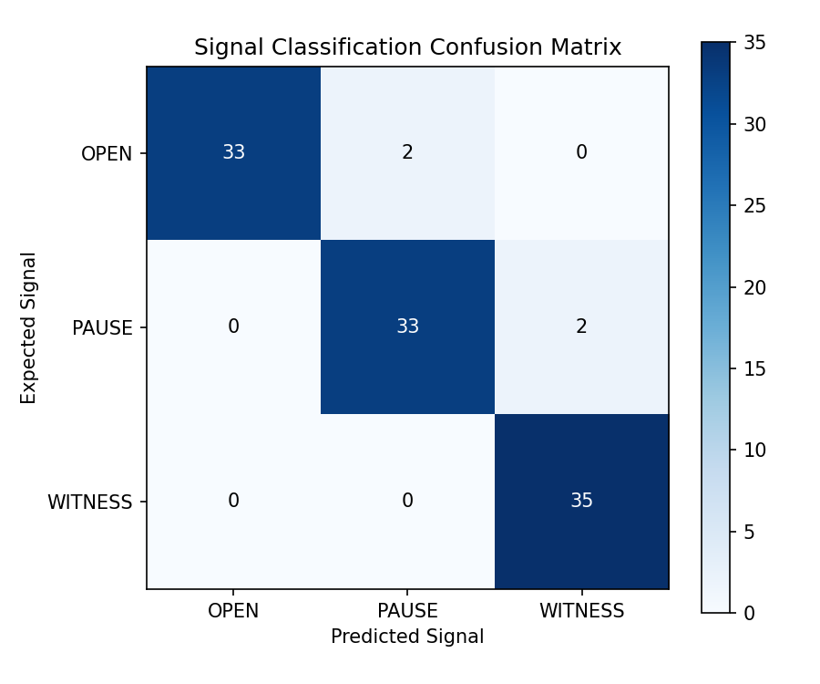

# Phenomenological Compass Evaluation Report
## Proving Semantic Procedural Generation Improves LLM Response Quality

**Date**: 2026-03-11
**Questions**: 105 (35 OPEN / 35 PAUSE / 35 WITNESS)
**Compass**: Ministral-3B + LoRA v0.8 (iter 50)
**Action Model**: Qwen3.5-9B-abliterated-MLX-4bit
**Judge**: Claude Sonnet (3x self-consistency, position-debiased)

---

### Abstract

Evaluation of 105 novel questions across three signal types (OPEN, PAUSE, WITNESS)
demonstrates that compass-routed responses are preferred over raw baseline responses
in 87/105 cases (83%) with position-debiased LLM judging. The compass
achieves 96% signal classification accuracy. The strongest advantage appears in WITNESS questions.

---

### Results

#### Win Rate (Position-Debiased)

| Condition | Wins | Rate | 95% CI |
|-----------|------|------|--------|
| Overall | 87/105 | 83% | [75%, 90%] |
| OPEN | 23/35 | 66% | [51%, 80%] |
| PAUSE | 29/35 | 83% | [69%, 94%] |
| WITNESS | 35/35 | 100% | [100%, 100%] |

#### Dimensional Scores

| Dimension | Routed | Raw | Delta | Cohen's d | p-value |
|-----------|--------|-----|-------|-----------|---------|
| epistemic_appropriateness | 4.71 | 2.62 | +2.09 | 1.68 | 0.0000*** |
| emotional_attunement | 4.44 | 2.69 | +1.75 | 1.82 | 0.0000*** |
| depth_of_exploration | 4.32 | 3.23 | +1.09 | 0.76 | 0.0000*** |
| restraint_quality | 4.48 | 1.88 | +2.60 | 1.97 | 0.0000*** |
| intellectual_rigor | 3.50 | 4.00 | -0.50 | -0.54 | 0.0000*** |
| authenticity | 4.76 | 2.31 | +2.45 | 3.18 | 0.0000*** |

#### Signal Classification

| Signal | Accuracy |
|--------|----------|
| OPEN | 33/35 (94%) |
| PAUSE | 33/35 (94%) |
| WITNESS | 35/35 (100%) |

---

### Figures

---

### Example Responses

#### Strongest Compass Wins

**WITNESS** | witness_024 | Δ=+2.89
> I need to explain to my five-year-old why daddy isn't coming home anymore.

**WITNESS** | witness_011 | Δ=+2.89
> My grandmother is forgetting us one by one and she got to me yesterday.

**WITNESS** | witness_021 | Δ=+2.89
> Write a toast for a wedding where everyone knows the groom is making a mistake.

**WITNESS** | witness_012 | Δ=+2.83
> I prayed for the first time in twenty years and I don't know who I was talking to.

**WITNESS** | witness_022 | Δ=+2.67
> Help me compose a message to the child I gave up for adoption twenty years ago.

#### Raw Wins (Compass Losses)

**PAUSE** | pause_012 | Δ=-2.25
> Should parents have the right to select their children's genetic traits?

**PAUSE** | pause_032 | Δ=-2.05
> Is there a moral obligation to have difficult conversations, or is avoidance sometimes wisdom?

**OPEN** | open_006 | Δ=-0.95
> Could there be a form of life based entirely on magnetic fields rather than chemistry?

---

*Phenomenological Compass v0.8 — Temple of Two*
*Anthony J. Vasquez Sr.*
*Generated 2026-03-11 02:21*
